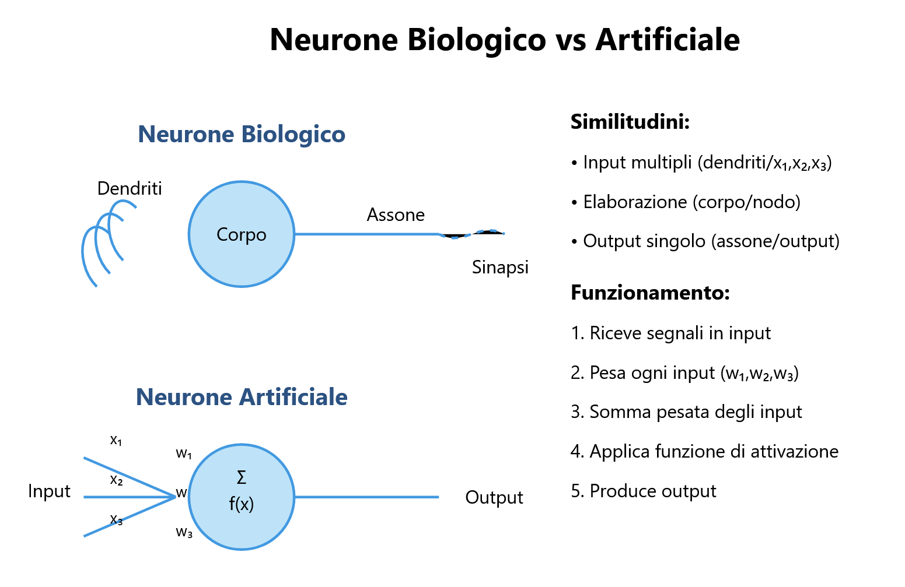
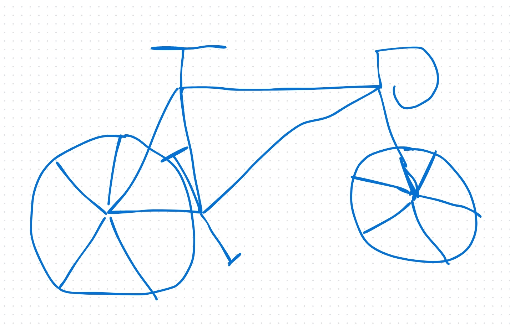

## Algoritmi Generativi

### 5.1 Introduzione

Gli **algoritmi generativi** come le reti neurali sono tra le tecnologie più avanzate e rivoluzionarie nel campo dell'Intelligenza Artificiale (AI). Questi strumenti permettono alle macchine di creare nuovi contenuti, come immagini, suoni e testo, che sono indistinguibili da quelli prodotti dagli esseri umani. Questo capitolo esplora i concetti fondamentali degli algoritmi generativi e le sue  applicazioni pratiche.



### 5.2 Cosa sono gli Algoritmi Generativi?

#### 5.2.1 Definizione di Algoritmi Generativi

Gli **algoritmi generativi** sono una classe di algoritmi di apprendimento automatico che generano dati sintetici, come immagini, suoni o testo, che sono simili a quelli reali. Questi algoritmi utilizzano una rete neurale artificiale per apprendere i modelli di dati reali e quindi generare nuovi dati sintetici.

#### 5.2.2 Perché gli Algoritmi Generativi sono importanti?

Gli algoritmi generativi sono importanti perché permettono di creare contenuti nuovi e originali senza la necessità di un intervento umano diretto. Questo apre nuove possibilità in campi come l'arte, la musica, il design e l'intrattenimento. Inoltre, gli algoritmi generativi possono essere utilizzati per aumentare i dataset esistenti, migliorando le prestazioni dei modelli di Machine Learning.

#### 5.2.3 Come funzionano gli Algoritmi Generativi?

Gli algoritmi generativi funzionano apprendendo i pattern e le strutture presenti nei dati di addestramento. Una volta addestrati, questi algoritmi possono generare nuovi dati che seguono le stesse distribuzioni e caratteristiche dei dati originali. Questo processo è spesso basato su tecniche come le **Reti Generative Avversariali (GAN)** e le **Reti Neurali Ricorrenti (RNN)**.

### 5.3 Reti Generative Avversariali (GAN)

#### 5.3.1 Cos'è una GAN?

Una **Rete Generativa Avversaria (GAN)** è un'architettura di apprendimento automatico introdotta da **Ian Goodfellow** nel 2014. Le GAN sono composte da due reti neurali che competono tra loro in un "gioco" a somma zero:

1. **Il Generatore (G)**: Produce dati sintetici cercando di imitare dei dati reali. Il suo obiettivo è creare esempi così convincenti da "ingannare" il Discriminatore.
2. **Il Discriminatore (D)**: Agisce come un "giudice", cercando di distinguere tra dati reali e generati. Deve classificare correttamente i dati come autentici o falsi.

#### 5.3.2 Come funziona una GAN?

Le due reti si allenano simultaneamente:

- Il Generatore migliora progressivamente la qualità dei dati sintetici.
- Il Discriminatore affina la sua capacità di rilevare le falsificazioni.

Questo processo continua fino a quando il Generatore produce dati che il Discriminatore non è più in grado di distinguere da quelli reali.


#### 5.3.3 Applicazioni delle GAN

Le GAN hanno una vasta gamma di applicazioni, tra cui:
- **Generazione di immagini fotorealistiche**: Le GAN possono creare immagini di volti, paesaggi e oggetti che sembrano reali.
- **Conversione di schizzi in fotografie**: Le GAN possono trasformare disegni o schizzi in immagini fotorealistiche.


- **Invecchiamento/ringiovanimento di volti**: Le GAN possono modificare l'età apparente di una persona in una foto.

- **Creazione di opere d'arte**: Le GAN possono generare opere d'arte originali in vari stili.
```text
Ecco l'immagine ottenuta con ilprompt seguente:
Un paesaggio onirico al tramonto, dove il cielo è dipinto con sfumature di arancione, viola e oro. Al centro, un grande albero antico con radici che si intrecciano nel terreno e rami che si estendono verso il cielo, illuminati da luci magiche. Intorno all'albero, piccole creature fatate con ali trasparenti volano in un'atmosfera scintillante. Sullo sfondo, montagne innevate si stagliano contro l'orizzonte, con un fiume cristallino che serpeggia attraverso la scena. L'immagine è ricca di dettagli, con texture realistiche e un'atmosfera da favola.
```

- **Sintesi di video**: Le GAN possono creare video realistici partendo da descrizioni testuali.

#### 5.3.4 Sfide delle GAN

Nonostante il loro potenziale, le GAN presentano alcune sfide:
- **Instabilità durante l'addestramento**: Le GAN possono essere difficili da addestrare a causa della competizione tra il Generatore e il Discriminatore.
- **Modal Collapse**: Il Generatore può iniziare a produrre sempre lo stesso output, limitando la varietà dei dati generati.
- **Qualità dei dati generati**: Anche se le GAN possono produrre dati realistici, a volte possono generare artefatti o imperfezioni.

### 5.4 Algoritmi Generativi in Azione

#### 5.4.1 Generazione di Immagini

Gli algoritmi generativi, come le GAN, sono utilizzati per creare immagini fotorealistiche, opere d'arte e design. Ad esempio, **DALL-E** è un modello generativo sviluppato da OpenAI che può creare immagini originali basate su descrizioni testuali.

#### 5.4.2 Generazione di Musica

Gli algoritmi generativi possono essere utilizzati per creare musica originale in vari stili. Modelli come **MuseNet** di OpenAI possono generare composizioni musicali complesse basate su input testuali o melodici.

#### 5.4.3 Generazione di Testo

Le RNN e i modelli Transformer, come **GPT-3**, sono utilizzati per generare testo coerente e contestualmente rilevante. Questi modelli possono essere utilizzati per scrivere articoli, poesie, codici di programmazione e molto altro.

#### 5.4.4 Sintesi di Voce

Gli algoritmi generativi possono essere utilizzati per sintetizzare voci realistiche basate su input testuali. Questo è particolarmente utile per applicazioni come gli assistenti vocali e la creazione di contenuti audio.

### 5.5 Sfide e Limiti degli Algoritmi Generativi

#### 5.5.1 Qualità dei Dati Generati

Anche se gli algoritmi generativi possono produrre dati realistici, a volte possono generare artefatti o imperfezioni. È importante valutare la qualità dei dati generati e garantire che siano utili per l'applicazione desiderata.

#### 5.5.2 Bias nei Dati di Addestramento

Gli algoritmi generativi possono essere influenzati da bias presenti nei dati di addestramento, portando a risultati distorti o discriminatori. È importante garantire che i dati di addestramento siano rappresentativi e privi di pregiudizi. Ad esempio se un modello di riconoscimento facciale viene addestrato principalmente su volti di una sola etnia, potrebbe avere difficoltà a riconoscere volti di altre etnie.

#### 5.5.3 Complessità Computazionale

Gli algoritmi generativi, in particolare le GAN, richiedono grandi quantità di dati e risorse computazionali per l'addestramento. Questo può rendere difficile l'implementazione di modelli complessi in contesti con risorse limitate.

#### 5.5.4 Etica e Responsabilità

La capacità degli algoritmi generativi di creare contenuti realistici solleva importanti questioni etiche, come la possibilità di creare deepfake o contenuti falsi. È essenziale utilizzare queste tecnologie in modo responsabile e garantire che siano impiegate per scopi positivi.

### 5.6 Conclusione

Gli algoritmi generativi e le reti neurali sono tecnologie potenti che stanno trasformando il modo in cui creiamo e interagiamo con i contenuti. Dalla generazione di immagini e musica alla sintesi di voce e testo, queste tecnologie hanno applicazioni pratiche in quasi ogni settore. Tuttavia, è essenziale affrontare le sfide e i limiti associati a queste tecnologie, garantendo che siano utilizzate in modo etico e responsabile. Mentre continuiamo a esplorare le potenzialità degli algoritmi generativi, è importante bilanciare l'innovazione con la consapevolezza delle implicazioni sociali e etiche.
